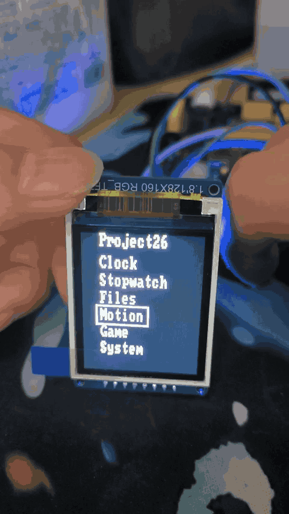
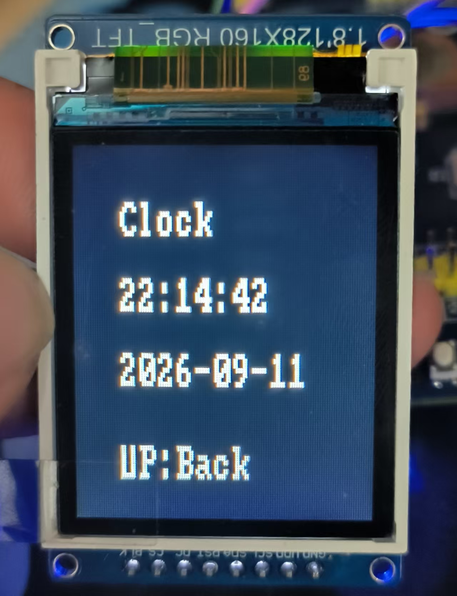
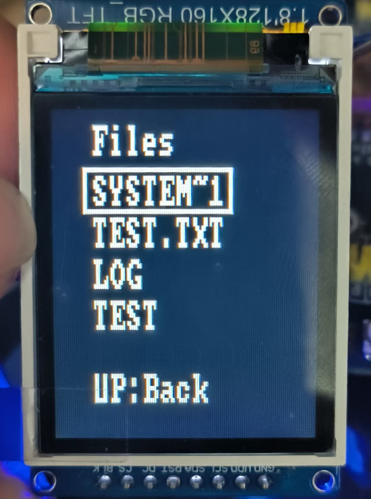
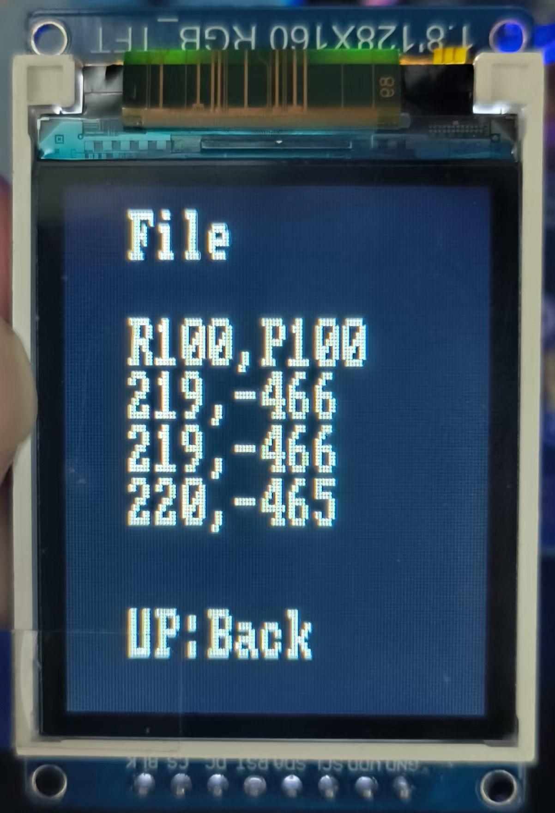
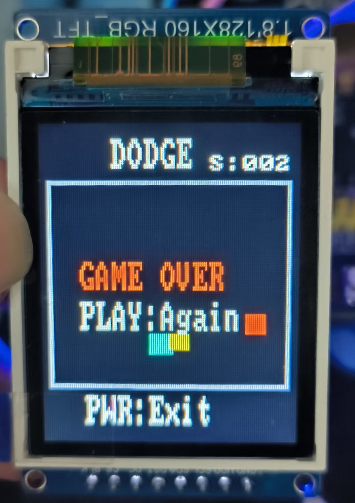
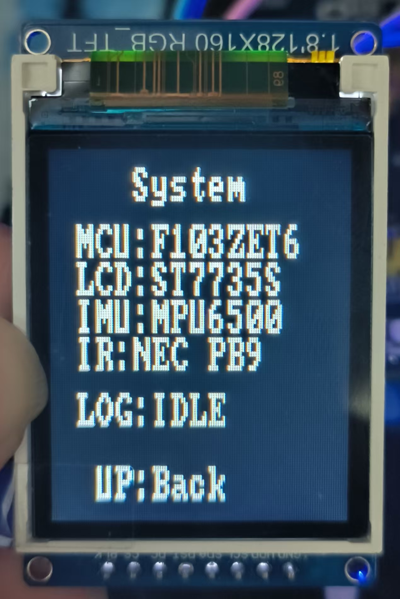

# Pocket Embedded Terminal

基于 STM32F103ZET6 + FreeRTOS 的掌上嵌入式应用终端

> 基于 STM32F103ZET6 + FreeRTOS 实现的嵌入式应用终端，集成 ST7735S 彩屏 UI、RTC、MPU6500 姿态采集、SDIO/FatFs 文件系统、后台 CSV Logger、NEC 红外遥控及小游戏。项目重点展示多任务调度、实时姿态采样、Queue 异步数据传递、后台 SD 数据记录和文件系统资源所有权设计。

## 演示效果

> V1 已完成编译、下载和实机回归验证，工程状态为 `0 Error / 0 Warning`。

<p align="center">
  
</p>

| Clock | Files / CSV 查看 |
| --- | --- |
|  |  |
|  |  |
|  | |

## 主要功能

- Launcher：提供 Clock、Stopwatch、Files、Motion、Game、System、Settings 共 7 个入口
- RTC 时钟与 Stopwatch
- Files 文件浏览及 CSV / 文本分页查看
- MPU6500 姿态采集与 Roll/Pitch 实时显示
- 后台 CSV Logger
- DODGE 小游戏及三档速度设置
- System 只读状态页面
- 实体按键输入与方向键长按重复
- NEC 红外遥控及 Repeat Frame 长按支持

## 硬件平台

| 组件 | 用途 |
| --- | --- |
| STM32F103ZET6 | 主控 MCU |
| ST7735S | 128 × 160 RGB565 TFT 彩屏 |
| MPU6500 | 加速度计与陀螺仪 |
| TF 卡 | 通过 SDIO 1-bit 模式进行 FAT32 存储 |
| LSE + CR1220 | RTC 时钟源与后备供电 |
| 红外接收器 + 遥控器 | NEC 红外输入 |
| 板载按键 | 本地 UI 输入 |

## 软件架构

工程保留 STM32CubeIDE 的标准目录布局，使用模块职责划分驱动、服务和应用层，不进行额外目录重构。

```text
板级 / CubeMX
  GPIO | I2C1 | SPI1 | SDIO | RTC | TIM4 | FreeRTOS objects
             |
             v
设备驱动
  ST7735 TFT | MPU6500 | NEC remote receiver
             |
             v
服务层
  Sensor | Logger | Storage | Stopwatch | Settings | Key
             |
             v
应用层
  UI state machine | Launcher | Files | Motion | Game | System
```

## FreeRTOS 任务设计

| 对象 | Priority | 职责 |
| --- | --- | --- |
| `ui_task` | Normal | 负责实体按键/红外输入、UI 状态机、页面绘制和周期刷新 |
| `sensor_task` | Normal | 约每 10 ms 读取一次 MPU6500，并生成 `motion_sample_t` |
| `logger_task` | AboveNormal | 处理 Logger Start/Stop 请求、消费 Queue，并独占 FatFs 写操作 |
| `motion_queue` | — | 32 条消息，用于解耦周期采样和非确定时延的 SD 卡存储 |

## Sensor / Logger 数据流

```text
Sensor_Task
  -> MPU6500 at about 100 Hz
  -> motion_sample_t
  -> motion_queue (32 entries)
  -> Logger_Task
  -> 512 Byte RAM buffer
  -> FatFs / SDIO
  -> 0:/LOG/MOTION01.CSV
```

`sensor_task` 不直接调用 `f_write()`：Sensor Task 需要保持约 100 Hz 周期采样，而 SD 卡写入存在非确定时延。Queue 用于解耦实时采样与后台存储，避免一次存储操作直接阻塞 Sensor Task。Queue 满时，Sensor Task 不等待，而是丢弃当前样本并记录 `dropped_sample_count`。

## FatFs 资源所有权

当前 V1 使用 FatFs，配置为 `_FS_REENTRANT = 0`。

- Logger 记录期间由 `logger_task` 独占 FatFs 与日志文件句柄
- Files 页面在记录期间禁止访问 SD 卡
- Files 目录和文件读取期间会暂时暂停任务调度，避免当前轮询 SDIO 操作被其他任务切换打断


## 姿态处理

- MPU6500 `WHO_AM_I` 检查
- 静止状态 Gyro 零偏校准
- Acc / Gyro 原始数据采集
- 基于加速度计计算 Roll / Pitch
- Gyro 转换为 °/s
- Complementary Filter 融合
- 约 100 Hz 周期采样

## 文件系统

- SDIO 1-bit 接口
- FAT32 TF 卡
- 根目录 / 子目录浏览
- TXT / CSV 文件读取
- 按完整行分页，避免 CSV 行被截断

## 输入方式

实体按键和 NEC 红外遥控统一映射为 UI Action。红外接收器通过 `TIM4_CH4 Input Capture` 测量 NEC 脉冲宽度；`NEC Repeat Frame` 用于满足当前方向键长按导航需求。

## DODGE 小游戏

`DODGE` 包含玩家移动、两个障碍物、碰撞检测、Score、Game Over 与 Restart。Settings 提供 `Slow`、`Normal`、`Fast` 三档更新速度。

## 工程结构

```text
.
├─ Core/
│  ├─ Inc/                 # CubeMX 头文件与手写模块接口
│  └─ Src/
│     ├─ game.c            # DODGE 游戏逻辑
│     ├─ key.c             # 实体按键抽象
│     ├─ logger.c          # 带缓冲的 CSV Logger
│     ├─ mpu6500.c         # MPU6500 原始 I2C 驱动
│     ├─ remote.c          # TIM4 Input Capture NEC 解码
│     ├─ sensor.c          # 校准与 Complementary Filter
│     ├─ settings.c        # V1 游戏速度设置
│     ├─ st7735.c          # TFT 驱动与字体绘制
│     ├─ storage.c         # FatFs 文件浏览与分页读取
│     ├─ stopwatch.c
│     └─ ui.c              # UI 状态机与页面绘制
├─ Drivers/                # STM32 HAL 与 CMSIS
├─ FATFS/                  # CubeMX FatFs 集成
├─ Middlewares/            # FreeRTOS 与 FatFs 源码
├─ docs/
│  └─ assets/              # README 图片与 demo GIF
├─ 26_Pocket_Embedded_Terminal.ioc
└─ STM32F103ZETX_FLASH.ld
```

## CSV 数据格式

```text
R100,P100
roll_x100,pitch_x100
```

示例：

```text
123,-456
```

表示：

```text
Roll  =  1.23°
Pitch = -4.56°
```

## 已知限制

- `MOTION01.CSV` 每次开始新记录时会覆盖旧文件
- Files 当前只支持向后分页
- 文件浏览缓存的目录项数量有限
- Settings 当前只保存在 RAM
- NEC Repeat 仅覆盖当前长按导航需求
- FatFs 尚未实现完整多任务并发访问

## 开发环境

- STM32CubeIDE
- STM32CubeMX
- STM32 HAL
- CMSIS-RTOS2 / FreeRTOS
